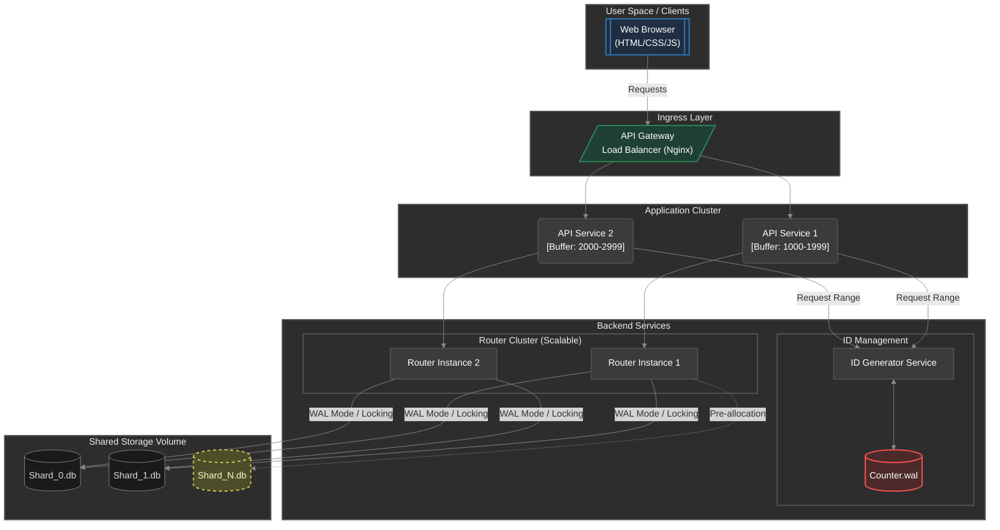
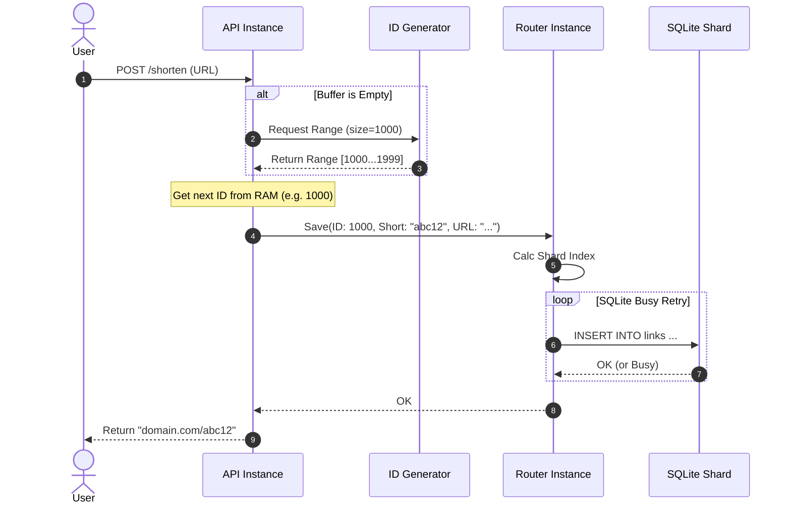
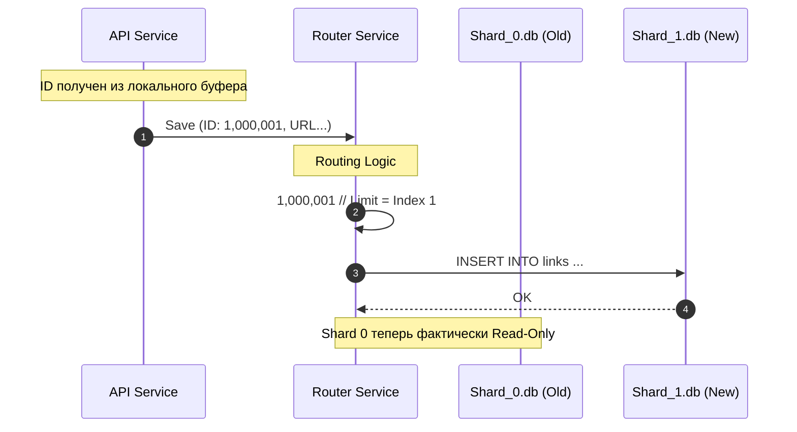
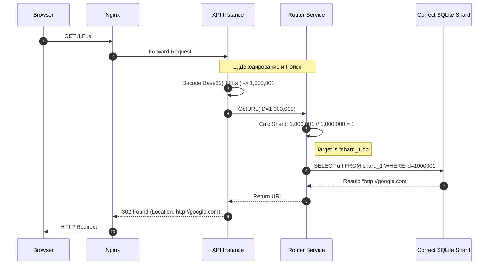

# Техническое решение проекта «CompactURL» (Распределённый сервис сокращения ссылок)

## 1. Введение

### 1.1. Назначение и цели проекта
**CompactURL** — это прототип высоконагруженного распределённого веб-сервиса для сокращения длинных URL-адресов. Проект направлен на решение классической задачи System Design с упором на механизмы бесконечного горизонтального масштабирования хранилища и балансировки нагрузки.

**Цель проекта:**
Создать отказоустойчивую систему, способную обрабатывать постоянно растущий поток запросов, динамически увеличивая количество шардов базы данных без остановки сервиса.

**Основные задачи:**
- Реализация механизма **динамического шардирования** (Range-Based Sharding) базы данных SQLite.
- Разработка **генератора уникальных идентификаторов** с пакетной выдачей (Batch ID Allocation) для минимизации сетевых задержек и повышения отказоустойчивости.
- Построение кластеризуемого сервиса маршрутизации (**Router Service**), умеющего автоматически создавать новые файлы БД при переполнении текущих.
- Обеспечение минимальной задержки при перенаправлении пользователя.

**Основания для разработки:**
Учебный проект в рамках курса «Основы распределенных вычислений». Демонстрация архитектурного решения проблемы «Big Data» и устранения единых точек отказа (SPOF).

### 1.2. Команда разработки

| Роль | ФИО |
| :--- | :--- |
| Team Lead, Fullstack Developer | Кирющенков Александр Евгеньевич |
| Backend Developer | Шарипов Анушервон Абдусаторович |
| Fullstack Developer | Пахнушева Алёна Вадимовна |

---

## 2. Глоссарий

| Термин | Определение |
| :--- | :--- |
| **Длинный URL** | Исходный URL-адрес (ресурс), к которому пользователь хочет получить короткий доступ. |
| **Short Code (Короткий код)** | Уникальная строка (например, `Ab3d9X`), являющаяся ключом для поиска длинного URL. |
| **ID Generator** | Сервис-координатор, который резервирует диапазоны (например, по 1000 ID) для каждого инстанса API Service. Хранит только последнее выданное значение верхней границы. |
| **Router Service** | Сервис, управляющий топологией данных. Определяет, в какой файл писать или читать данные, основываясь на числовом ID. |
| **Шард (Shard)** | Физически независимая часть хранилища (файл `shard_X.db`), содержащая фиксированный диапазон ссылок (например, 1 млн записей). |
| **Base62** | Алгоритм кодирования чисел в строку, использующий символы `a-z`, `A-Z`, `0-9`. |
| **Ingress Layer** | Слой входа трафика, осуществляющий терминацию SSL и балансировку нагрузки (Nginx). |

---

## 3. Функциональные требования

**Сокращение ссылок**:

* Пользователь должен иметь возможность отправить длинный URL и получить в ответ уникальную короткую ссылку.
* Система должна корректно обрабатывать ошибки (например, некорректный URL).

**Перенаправление (Редирект)**:

* При переходе по короткой ссылке пользователь должен быть автоматически перенаправлен на исходный ресурс.
* Если ссылка не существует, пользователь должен увидеть сообщение об ошибке (страница 404).

---

## 4. Ограничения

1.  **Протокол:** Сервис работает только по HTTP/HTTPS.
2.  **Формат кодов:** Короткие коды состоят только из `[a-z,A-Z,0-9]`.
3.  **Хранилище:** Используется множество файлов **SQLite**. Система должна поддерживать работу с произвольным количеством файлов.
4.  **Емкость шарда:** Размер одного шарда искусственно ограничен (1 000 000 записей), после чего открывается следующий.
5.  **TTL:** Ссылки хранятся вечно.

---

## 5. Нефункциональные требования

- **Производительность(Write):** Время генерации новой ссылки < 200 мс.
-   **Производительность(Read):** Время ответа на редирект < 100 мс. Поиск файла шарда должен быть O(1).
-   **Масштабируемость хранилища:** Теоретически неограниченная. Добавление новых данных не должно замедлять работу старых шардов.
- **Масштабируемость Router Service**: Возможность запуска N экземпляров Router Service.
-   **Отказоустойчивость:** Повреждение файла `shard_5.db` не влияет на доступность данных в `shard_0.db` ... `shard_4.db`.

---

## 6. Пользовательские сценарии

### Сценарий 1: Пользователь сокращает ссылку
1.  Пользователь заходит на главную страницу и вставляет длинный URL. 
2.  Нажимает кнопку "Сократить".
3.  Система обрабатывает запрос и возвращает короткую ссылку. 

### Сценарий 2: Пользователь переходит по ссылке
1. Пользователь кликает по ссылке в браузере.
2. Браузер автоматически перенаправляется на исходный URL.
3. Пользователь видит целевой сайт.

---

## 7. Архитектура системы

Архитектура построена по принципу микросервисов с динамическим слоем данных.

### Компоненты
1.  **Ingress (Nginx):** Единая точка входа, балансировщик нагрузки.
2. **API Service**:
* Обрабатывает HTTP запросы от клиентов.
* Внутреннее состояние: Хранит в памяти зарезервированный диапазон ID, полученный от ID Generator.
* Выполняет кодирование ID -> Base62.
3. **ID Generator Service**:
* Персистентность: Хранит состояние счетчика в локальном файле (counter.wal или SQLite), чтобы пережить перезапуск сервиса без потери данных и дублирования ID.
* Выдает ID большими пачками (например, по 1000 штук).
4. **Router Service**:

* Группа независимых инстансов, работающих с общим сетевым хранилищем.
* Используется режим **SQLite WAL (Write-Ahead Logging)**, который допускает множество читателей и одного писателя.
* При ошибке SQLITE_BUSY (файл занят другим Роутером) реализуется механизм экспоненциальных повторов.
* Отвечает за выбор шарда и преаллокацию.

### Архитектурная диаграмма

---

## 8. Технические сценарии

### Сценарий 1: Создание короткой ссылки (Write Path)

Этот сценарий показывает, как система создает короткую ссылку (например, ID=1000001).
1. Пользователь отправляет запрос через веб-интерфейс.
2. **API Service** получает запрос на сокращение ссылки.
3. **API Service** проверяет свой локальный буфер ID в памяти:
* Вариант А (Буфер не пуст): Берет следующий свободный ID из памяти
* Вариант Б (Буфер пуст): Делает синхронный запрос к ID Generator с параметром size=1000. Получает диапазон (например, 1000-1999). Берет первый ID (1000), остальные 999 сохраняет в памяти.
4. **API Service** передает данные (ID, ShortCode, URL) в один из инстансов Router Service.
5. **Router Service** определяет целевой шард и пытается выполнить запись. Если файл занят, повторяет попытку.
6. После успешной записи возвращается ответ пользователю.

### Сценарий 2: Автоматическое шардирование (Pre-allocation Sharding)

1. **Router Service** при каждой вставке проверяет заполненность текущего  шарда.
2. Допустим, лимит шарда — 1 млн записей. Когда shard_0.db заполнен на 90% (ID достигает 900,000):
3. **Router** запускает фоновую задачу на создание следующего файла shard_1.db и инициализацию таблицы в нем.
4. К моменту, когда ID достигнет 1,000,001, файл shard_1.db уже готов к работе.

```mermaid
sequenceDiagram
    autonumber
    participant Router as Router Service
    participant S0 as Shard_0.db
    participant S1 as Shard_1.db

    Router->>S0: INSERT (ID: 900,000...)
    
    rect rgb(40, 40, 40)
        Note right of Router: Проверка: Shard 0 заполнен на 90%
        Router->>S1: (Background) Create File & Table
        S1-->>Router: Ready
    end
    
    Note right of Router: Теперь система готова к ID > 1,000,000

```

### Сценарий 3: Переход границы шарда (Shard Transition)

Этот сценарий показывает, как система обрабатывает переход границы шарда (например, ID=1000001).
1. **API Service** присваивает очередной ID из памяти: 1,000,001. (API не знает о шардах).
2. **API Service** отправляет данные в Router Service.
3. **Router Service** вычисляет индекс: 1,000,001 // 1,000,000 = 1.
4. **Router** понимает, что писать нужно в shard_1.db.
5. **Router** выполняет INSERT в новый файл (который был создан заранее благодаря преаллокации).

### Сценарий 4: Редирект по ссылке (Read Path)

1.  **API Service** декодирует Base62 строку в ID (например, `1,000,001`).
2.  **Router Service** вычисляет индекс шарда по той же формуле (Range Logic).
3.  Определяет, что данные находятся в `shard_1.db`.
4.  Выполняет SELECT из конкретного файла. Остальные $N$ файлов не затрагиваются.
5.  **Router Service** возвращает исходный URL
6.  **API Service** выполняет редирект

---

## 9. План разработки и тестирования

### Этап 1: MVP (Single Node)
*   **Задача:** Реализовать базовую логику без шардирования. API Service напрямую работает с файлом shard_0.db. Router Service на этом этапе отсутствует.
*   **Результат:** Работающий сервис с одним файлом `shard_0.db`.

### Этап 2: Динамическое шардирование (Infinite Scale)
*   **Задача:** Внедрить **Router Service** с логикой ID // Limit. API Service перестает знать о файлах БД. Он делегирует операции ввода-вывода Router Service.

*   **Тест:** Установить лимит шарда в 10 записей (для теста). Добавить 25 ссылок.
*   **Ожидаемый результат:** Автоматически создадутся `shard_0.db`, `shard_1.db`, `shard_2.db`. Данные распределятся как 10/10/5.

### Этап 3: Нагрузочное тестирование
*   **Задача:** Docker Compose с Nginx и несколькими репликами API и Router.
*   **Тест:** Подача параллельного трафика, приводящая к созданию множества шардов (N > 10). Проверка того, что скорость чтения из старых шардов не падает при записи в новые и отсутствия ошибок Database Locked.
---

## 10. Технологический стек

| Компонент | Технология | Обоснование |
| :--- | :--- | :--- |
| **Язык разработки** | Python 3.14 | Скорость разработки, богатые библиотеки. |
| **Веб-фреймворк** | FastAPI | Асинхронность. |
| **API Gateway** | Nginx | Балансировка нагрузки. |
| **База данных** | SQLite (Multi-file) | Демонстрация принципа **Distributed Storage** через набор локальных файлов без оверхеда на кластеры взрослых БД. |
| **Контейнеризация** | Docker & Compose | Изоляция сервисов. |

## 11. Definition of Done

Проект считается завершенным, если выполнены следующие условия:

1. **Функциональность:** Реализованы все сценарии использования (сокращение ссылки, редирект, создание новых шардов).
2. **Код:**
* Весь код находится в репозитории.
* Отсутствуют критические баги.
* Стиль кода соответствует PEP8.
3. **Тестирование:**
* Unit-тесты покрывают >70% бизнес-логики.
* Успешно пройден интеграционный тест на переход границы шарда (переключение с shard_0 на shard_1).
4. **Инфраструктура:**
* Приложение запускается одной командой docker-compose up.
* Перезапуск контейнеров не приводит к потере данных.
5. **Документация:** Актуализированы README и API документация.