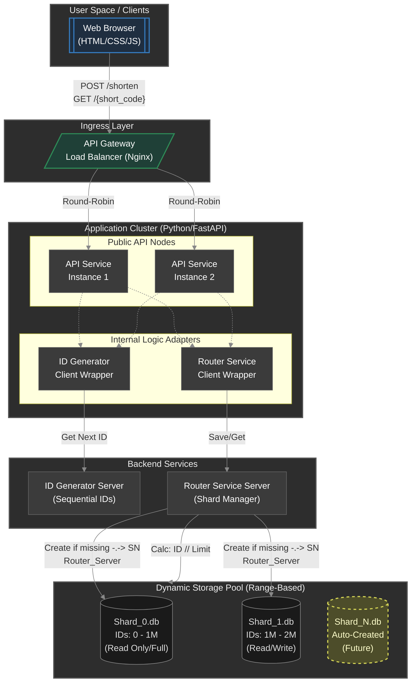
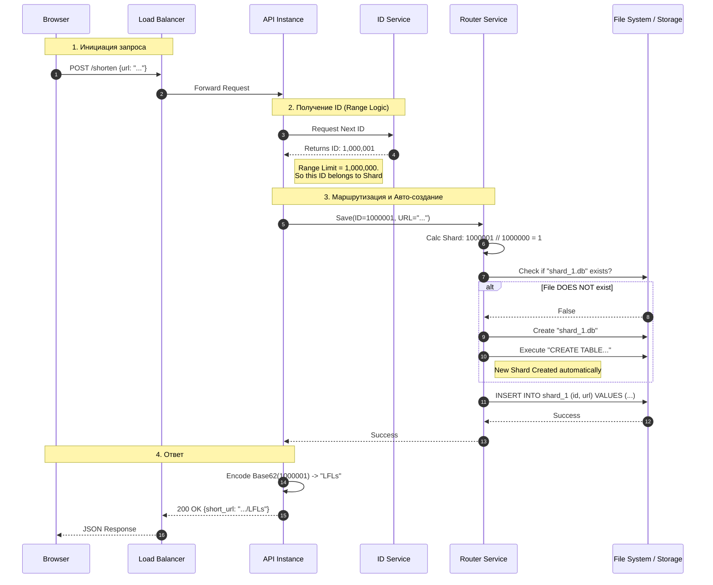
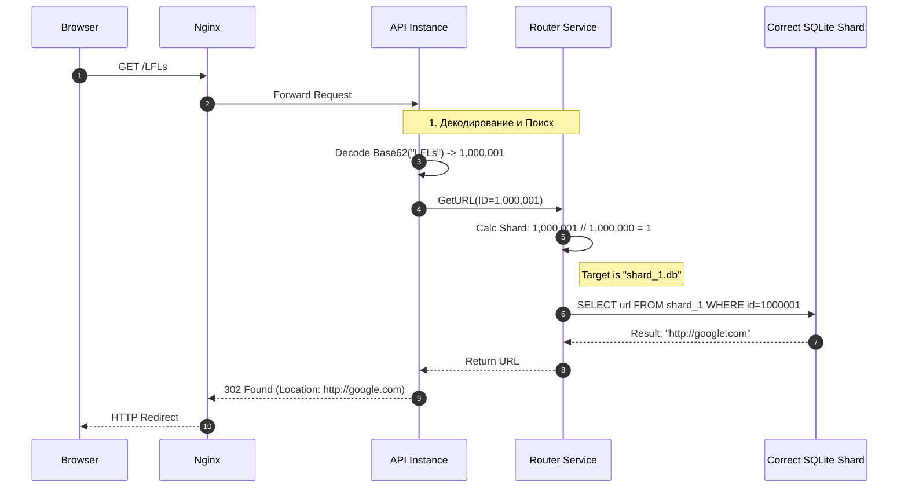

# Техническое решение проекта «CompactURL» (Распределённый сервис сокращения ссылок)

## 1. Введение

### 1.1. Назначение и цели проекта
**CompactURL** — это прототип высоконагруженного распределённого веб-сервиса для сокращения длинных URL-адресов. Проект направлен на решение классической задачи System Design с упором на механизмы бесконечного горизонтального масштабирования хранилища и балансировки нагрузки.

**Цель проекта:**
Создать отказоустойчивую систему, способную обрабатывать постоянно растущий поток запросов, динамически увеличивая количество шардов базы данных без остановки сервиса.

**Основные задачи:**
- Реализация механизма **динамического шардирования** (Range-Based Sharding) базы данных SQLite.
- Разработка **генератора уникальных последовательных идентификаторов** (ID Generator) для корректного распределения данных по диапазонам.
- Построение сервиса маршрутизации (**Router Service**), умеющего автоматически создавать новые файлы БД при переполнении текущих.
- Обеспечение минимальной задержки при перенаправлении пользователя.

**Основания для разработки:**
Учебный проект в рамках курса «Основы распределенных вычислений». Демонстрация архитектурного решения проблемы «Big Data», когда количество записей превышает возможности одного физического файла или сервера, требуя распределения по $N$ шардам.

### 1.2. Команда разработки

| Роль | ФИО |
| :--- | :--- |
| Team Lead, Fullstack Developer | Кирющенков Александр Евгеньевич |
| Backend Developer | Шарипов Анушервон Абдусаторович |
| Fullstack Developer | Пахнушева Алёна Вадимовна |

---

## 2. Глоссарий

| Термин | Определение |
| :--- | :--- |
| **Длинный URL** | Исходный URL-адрес (ресурс), к которому пользователь хочет получить короткий доступ. |
| **Short Code (Короткий код)** | Уникальная строка (например, `Ab3d9X`), являющаяся ключом для поиска длинного URL. |
| **ID Generator** | Сервис, отвечающий за выдачу глобально уникальных инкрементальных числовых идентификаторов. Последовательность важна для определения диапазона шарда. |
| **Router Service** | Сервис, управляющий топологией данных. Определяет, в какой файл писать или читать данные, основываясь на числовом ID. |
| **Шард (Shard)** | Физически независимая часть хранилища (файл `shard_X.db`), содержащая фиксированный диапазон ссылок (например, 1 млн записей). |
| **Base62** | Алгоритм кодирования чисел в строку, использующий символы `a-z`, `A-Z`, `0-9`. |
| **Ingress Layer** | Слой входа трафика, осуществляющий терминацию SSL и балансировку нагрузки (Nginx). |

---

## 3. Функциональные требования

### Для Public API Service:
1.  **Создание короткой ссылки (`POST /shorten`):**
    *   Принимает JSON с длинным URL.
    *   Взаимодействует с ID Generator для получения следующего порядкового номера.
    *   Передает ID и URL в Router Service для сохранения.
    *   Возвращает готовую короткую ссылку.
2.  **Редирект (`GET /{short_code}`):**
    *   Принимает короткий код, декодирует его в ID.
    *   Запрашивает URL у Router Service.
    *   Возвращает HTTP 301/302 или 404.

### Для ID Generator Service:
3.  **Выдача последовательных ID:** Гарантирует строгую последовательность или выдачу диапазонов, чтобы эффективно заполнять шарды.

### Для Router Service:
4.  **Маршрутизация и масштабирование:**
    *   Реализует алгоритм **Range-Based Sharding**.
    *   Формула выбора шарда: `Shard_Index = ID // Shard_Capacity`.
    *   **Автоматическое создание шардов:** Если вычисленный `Shard_Index` указывает на несуществующий файл (например, перешли с 3-го на 4-й миллион записей), сервис должен автоматически инициализировать новый файл `shard_N.db`.

### Для Frontend:
5.  **Веб-интерфейс:** Простая форма ввода ссылки, кнопка "Сократить", отображение результата.

---

## 4. Ограничения

1.  **Протокол:** Сервис работает только по HTTP/HTTPS.
2.  **Формат кодов:** Короткие коды состоят только из `[a-z,A-Z,0-9]`.
3.  **Хранилище:** Используется множество файлов **SQLite**. Система должна поддерживать работу с произвольным количеством файлов (от `shard_0.db` до `shard_N.db`).
4.  **Емкость шарда:** Для демонстрации масштабируемости размер одного шарда искусственно ограничен (1 000 000 записей), после чего открывается следующий.
5.  **TTL:** Ссылки хранятся вечно.

---

## 5. Нефункциональные требования

-   **Производительность:** Время ответа на редирект < 100 мс. Поиск файла шарда должен быть O(1).
-   **Масштабируемость хранилища:** Теоретически неограниченная. Добавление новых данных не должно замедлять работу старых шардов.
-   **Отказоустойчивость:** Повреждение файла `shard_5.db` не влияет на доступность данных в `shard_0.db` ... `shard_4.db`.
-   **Concurrency:** Корректная работа при одновременной записи в текущий "горячий" шард.

---

## 6. Пользовательские сценарии

### Сценарий 1: Пользователь сокращает ссылку
1.  Пользователь вводит длинный URL.
2.  Система присваивает ссылке ID `3,000,005`.
3.  Так как лимит шарда `1,000,000`, система понимает, что ID попадает в диапазон `shard_3` (3M - 4M).
4.  Ссылка сохраняется в `shard_3.db`.
5.  Пользователь получает короткий код.

### Сценарий 2: Пользователь переходит по ссылке
1.  Пользователь кликает по короткой ссылке.
2.  Система декодирует код в ID `3,000,005`.
3.  Router вычисляет: "Этот ID лежит в 4-м по счету файле (`shard_3.db`)".
4.  Происходит чтение только из одного конкретного файла.
5.  Редирект.

---

## 7. Архитектура системы

Архитектура построена по принципу микросервисов с динамическим слоем данных.

### Компоненты
1.  **Ingress (Nginx):** Балансировщик нагрузки.
2.  **Application Cluster (Public API):** Stateless-сервисы на **FastAPI**.
3.  **Backend Services:**
    *   **ID Generator:** "Сердце" системы, задающее ритм создания шардов.
    *   **Router Service:** Менеджер файловой системы, реализующий логику `ID -> FilePath`.
4.  **Data Layer (Dynamic Storage Pool):** Набор баз данных SQLite.
    *   `Shard_0.db` (Архивный, Read-only, так как заполнен).
    *   ...
    *   `Shard_N.db` (Активный, Read/Write).
    *   При переполнении `Shard_N` автоматически создается `Shard_N+1`.

### Архитектурная диаграмма

---

## 8. Технические сценарии

### Сценарий 1: Создание короткой ссылки (Write Path & Auto-Sharding)

Этот сценарий показывает, как система обрабатывает переход границы шарда (например, ID=1000001).

1.  **API Service** получает запрос и запрашивает новый ID у `ID Server`.
2.  `ID Server` выдает `1,000,001`.
3.  **Router Service** принимает данные.
    *   Вычисляет индекс шарда: `1,000,001 // 1,000,000 = 1`.
    *   Проверяет наличие файла `shard_1.db`.
    *   *Условие:* Если файла нет (мы только что заполнили `shard_0`), Router **создает** новый файл `shard_1.db` и инициализирует в нем таблицу.
4.  Выполняется `INSERT` в новый шард.

### Сценарий 2: Редирект по ссылке (Read Path)

1.  **API Service** декодирует Base62 строку в ID (например, `1,000,001`).
2.  **Router Service** вычисляет индекс шарда по той же формуле (Range Logic).
3.  Определяет, что данные находятся в `shard_1.db`.
4.  Выполняет SELECT из конкретного файла. Остальные $N$ файлов не затрагиваются.

---

## 9. План разработки и тестирования

### Этап 1: MVP (Single Node)
*   **Задача:** Реализовать базовую логику без шардирования.
*   **Результат:** Работающий сервис с одним файлом `shard_0.db`.

### Этап 2: Динамическое шардирование (Infinite Scale)
*   **Задача:** Внедрить `Router Service` с логикой `ID // Limit`.
*   **Тест:** Установить лимит шарда в 10 записей (для теста). Добавить 25 ссылок.
*   **Ожидаемый результат:** Автоматически создадутся `shard_0.db`, `shard_1.db`, `shard_2.db`. Данные распределятся как 10/10/5.

### Этап 3: Нагрузочное тестирование
*   **Задача:** Docker Compose с Nginx и несколькими репликами API.
*   **Тест:** Подача трафика, приводящая к созданию множества шардов (N > 10). Проверка того, что скорость чтения из старых шардов не падает при записи в новые.

---

## 10. Технологический стек

| Компонент | Технология | Обоснование |
| :--- | :--- | :--- |
| **Язык разработки** | Python 3.14 | Скорость разработки, богатые библиотеки. |
| **Веб-фреймворк** | FastAPI | Асинхронность. |
| **API Gateway** | Nginx | Балансировка нагрузки. |
| **База данных** | SQLite (Multi-file) | Демонстрация принципа **Distributed Storage** через набор локальных файлов без оверхеда на кластеры взрослых БД. |
| **Контейнеризация** | Docker & Compose | Изоляция сервисов. |

